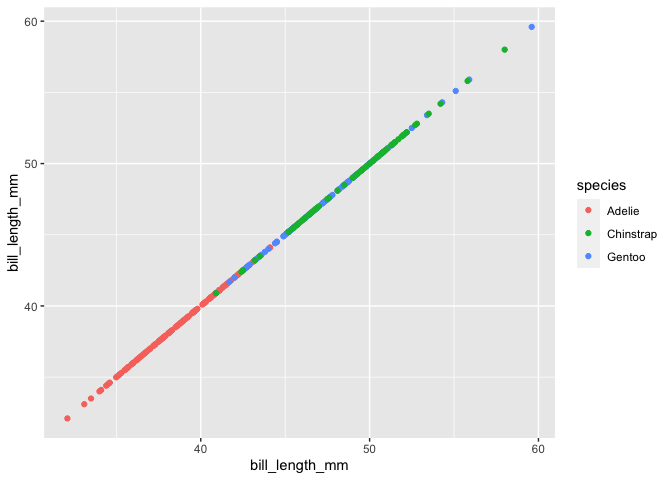

HW 1 P8105
================
Michelle Poimboeuf
2020-09-17

This is my solution to HW1

``` r
library(tidyverse)
```

    ## ── Attaching packages ─────────────────────────────────────────────────── tidyverse 1.3.0 ──

    ## ✓ ggplot2 3.3.2     ✓ purrr   0.3.4
    ## ✓ tibble  3.0.3     ✓ dplyr   1.0.2
    ## ✓ tidyr   1.1.2     ✓ stringr 1.4.0
    ## ✓ readr   1.3.1     ✓ forcats 0.5.0

    ## ── Conflicts ────────────────────────────────────────────────────── tidyverse_conflicts() ──
    ## x dplyr::filter() masks stats::filter()
    ## x dplyr::lag()    masks stats::lag()

## Problem 1

Create a dataframe with the specified elements.

``` r
prob1_df = 
tibble(
  samp = rnorm(10),
  samp_gt_0 = samp > 0, 
  char_vec = c("a", "b", "c", "d", "e", "f", "g", "h", "i", "j"),
  factor_vec = factor(c("low", "low", "low", "mod", "mod", "mod", "mod", "high", "high", "high"))
)
```

Take the mean of each variable in my data frame.

``` r
mean(pull(prob1_df, samp))
```

    ## [1] 0.1693375

``` r
mean(pull(prob1_df, samp_gt_0))
```

    ## [1] 0.5

``` r
mean(pull(prob1_df, char_vec))
```

    ## Warning in mean.default(pull(prob1_df, char_vec)): argument is not numeric or
    ## logical: returning NA

    ## [1] NA

``` r
mean(pull(prob1_df, factor_vec))
```

    ## Warning in mean.default(pull(prob1_df, factor_vec)): argument is not numeric or
    ## logical: returning NA

    ## [1] NA

I can take the mean of the numeric and logical vectors, but not the
factor or the character vectors. This makes some sense as numbers have
means. It is a bit confusing as to why you would be able to take the
mean of the logical vector, when you wouldn’t be able to take it of the
factor or character vectors. I see that R will code things in a way that
does not necessarily make sense.

``` r
as.numeric(pull(prob1_df, samp))
as.numeric(pull(prob1_df, samp_gt_0))
as.numeric(pull(prob1_df, char_vec))
```

    ## Warning: NAs introduced by coercion

``` r
as.numeric(pull(prob1_df, factor_vec))
```

Above, adding the as.numeric code to the beginning of the chunk
explicitly performs the action that R was performing behind the scenes
in the last code chunk. It shows the steps to coding the vectors as
numeric and helps explain why R thinks it can take the mean of certain
vectors.

Second Code Chunk for Problem 1:

``` r
#converting the logical vector to numeric, and multiplying the random sample by the result
as.numeric(pull(prob1_df, samp_gt_0))*pull(prob1_df, samp)
```

    ##  [1] 0.5697533 2.1492222 0.0000000 0.0000000 1.2460457 0.0000000 0.1783240
    ##  [8] 0.4964348 0.0000000 0.0000000

``` r
#converting the logical vector to a factor, and multiplying the random sample by the result
factor(pull(prob1_df, samp_gt_0))*pull(prob1_df, samp)
```

    ## Warning in Ops.factor(factor(pull(prob1_df, samp_gt_0)), pull(prob1_df, : '*'
    ## not meaningful for factors

    ##  [1] NA NA NA NA NA NA NA NA NA NA

``` r
#converting the logical vector to a factor and then converting the result to numeric, and multiply the random sample by the result
as.numeric(factor(pull(prob1_df, samp_gt_0)))*pull(prob1_df, samp)
```

    ##  [1]  1.1395065198  4.2984443716 -1.1298910249 -0.8977083612  2.4920914180
    ##  [6] -0.8980880445  0.3566479630  0.9928696660 -0.0200032474 -0.0007139943

\#\#Problem 2 pt. 1

Below is my code and inline comments for problem 2, part 1.

``` r
#installing packages
data("penguins", package = "palmerpenguins")
#viewing dataset
view(penguins)
#This dataset contains information about different species of penguins. It includes information on their species, the island they come from, their bill length/depth in millimeters, their flipper length in millimeters, their body mass in grams, sex, and a corresponding year (2007-2009). It is input as individual level data.
ncol(penguins)
```

    ## [1] 8

``` r
nrow(penguins)
```

    ## [1] 344

``` r
#From the output and the above code, I can see that their are 344 penguins (rows) and 8 variables (columns).
skimr::skim(penguins)
```

|                                                  |          |
| :----------------------------------------------- | :------- |
| Name                                             | penguins |
| Number of rows                                   | 344      |
| Number of columns                                | 8        |
| \_\_\_\_\_\_\_\_\_\_\_\_\_\_\_\_\_\_\_\_\_\_\_   |          |
| Column type frequency:                           |          |
| factor                                           | 3        |
| numeric                                          | 5        |
| \_\_\_\_\_\_\_\_\_\_\_\_\_\_\_\_\_\_\_\_\_\_\_\_ |          |
| Group variables                                  | None     |

Data summary

**Variable type: factor**

| skim\_variable | n\_missing | complete\_rate | ordered | n\_unique | top\_counts                 |
| :------------- | ---------: | -------------: | :------ | --------: | :-------------------------- |
| species        |          0 |           1.00 | FALSE   |         3 | Ade: 152, Gen: 124, Chi: 68 |
| island         |          0 |           1.00 | FALSE   |         3 | Bis: 168, Dre: 124, Tor: 52 |
| sex            |         11 |           0.97 | FALSE   |         2 | mal: 168, fem: 165          |

**Variable type: numeric**

| skim\_variable      | n\_missing | complete\_rate |    mean |     sd |     p0 |     p25 |     p50 |    p75 |   p100 | hist  |
| :------------------ | ---------: | -------------: | ------: | -----: | -----: | ------: | ------: | -----: | -----: | :---- |
| bill\_length\_mm    |          2 |           0.99 |   43.92 |   5.46 |   32.1 |   39.23 |   44.45 |   48.5 |   59.6 | ▃▇▇▆▁ |
| bill\_depth\_mm     |          2 |           0.99 |   17.15 |   1.97 |   13.1 |   15.60 |   17.30 |   18.7 |   21.5 | ▅▅▇▇▂ |
| flipper\_length\_mm |          2 |           0.99 |  200.92 |  14.06 |  172.0 |  190.00 |  197.00 |  213.0 |  231.0 | ▂▇▃▅▂ |
| body\_mass\_g       |          2 |           0.99 | 4201.75 | 801.95 | 2700.0 | 3550.00 | 4050.00 | 4750.0 | 6300.0 | ▃▇▆▃▂ |
| year                |          0 |           1.00 | 2008.03 |   0.82 | 2007.0 | 2007.00 | 2008.00 | 2009.0 | 2009.0 | ▇▁▇▁▇ |

``` r
#Using the skimr command, I found the mean of flipper_length_mm: 201mm.
```

\#\#Problem 2 pt. 2

``` r
#library(ggplot2)
    
set.seed(1000)

ggplot(penguins, aes(x = bill_length_mm, y = bill_length_mm)) + geom_point(aes(color = species))
```

    ## Warning: Removed 2 rows containing missing values (geom_point).

<!-- -->

``` r
#saving first scatter plot below
ggsave("penguin_scatterplot.pdf", height = 4, width = 4)
```

    ## Warning: Removed 2 rows containing missing values (geom_point).
